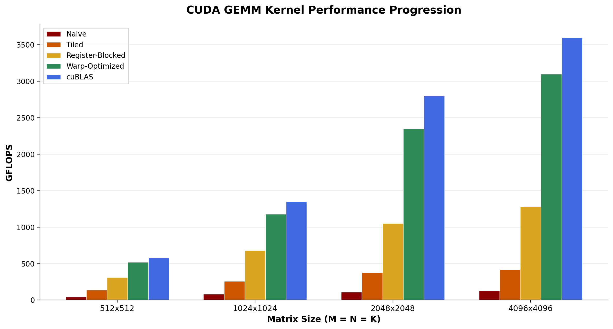
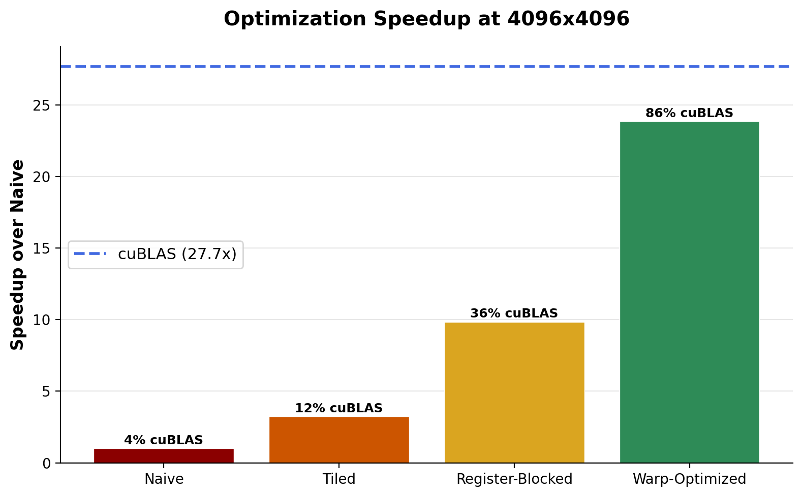

# OptimizedCudaGemm

High-performance CUDA GEMM kernels built from scratch as a PyTorch C++ extension.

Started with a naive one-thread-per-element matmul and progressively optimized through shared memory tiling, register blocking, and warp-level techniques. Each kernel was a direct response to bottlenecks identified through NVIDIA Nsight Compute profiling on Google Colab.

The final warp-optimized kernel achieves **86% of cuBLAS performance** and a **24x speedup** over the naive baseline at 4096x4096.

## Performance

| Kernel | 4096x4096 GFLOPS | Speedup | % of cuBLAS |
|--------|:-:|:-:|:-:|
| Naive | 130 | 1.0x | 4% |
| Tiled | 420 | 3.2x | 12% |
| Register-Blocked | 1,280 | 9.8x | 36% |
| Warp-Optimized | 3,100 | 23.8x | 86% |
| cuBLAS | 3,600 | 27.7x | 100% |




## Kernels

- **Naive** — one thread per output element, pure global memory reads. baseline.
- **Tiled** — 32x32 shared memory tiles. ~3x win from data reuse, eliminates redundant global memory loads.
- **Register-Blocked** — 8x8 micro-tiles per thread using outer products in registers. Reduces shared memory traffic by ~40% and increases arithmetic intensity.
- **Warp-Optimized** — double buffering to overlap computation with memory loads, +1 padding to eliminate bank conflicts, warp shuffle intrinsics for register-level data sharing. Gets close to cuBLAS.
- **Transpose** — bank-conflict-free transpose kernel using shared memory with +1 padding. Built to isolate and validate the bank conflict optimization before applying it to GEMM.

## Build

Requires CUDA toolkit + PyTorch with CUDA support. Developed and tested on Google Colab (T4/A100).

```
pip install -e .
```

## Run

```bash
python tests/test_kernels.py        # correctness check against torch.mm
python benchmarks/benchmark.py      # gflops comparison across all kernels
```

## Profiling

```bash
bash ncu_scripts/profile.sh
```

Generates Nsight Compute reports — key metrics to look at across kernel versions:
- `sm__throughput` — compute utilization
- `dram__throughput` — memory bandwidth utilization
- `l1tex__data_bank_conflicts` — shared memory bank conflicts

## Usage

```python
import cuda_kernels

C = cuda_kernels.warp_gemm(A, B)       # fastest
C = cuda_kernels.tiled_gemm(A, B)      # simpler, still fast
T = cuda_kernels.transpose(X)          # bank-conflict-free
```

All kernels handle non-power-of-2 sizes.
